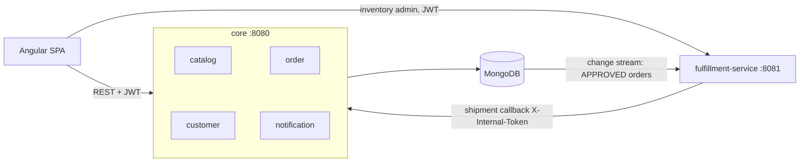

# Pet Store Modern

A migration of Sun's Java Pet Store 1.3.1 (J2EE 1.3, 2002) to a modern stack: Spring Boot 4.1 on Java 21, MongoDB, and Angular. The legacy application's four EARs, EJB entity beans, and XML-over-JMS order pipeline are re-implemented as two Spring Boot services over MongoDB documents — a modular `core` (catalog, customer, order, notification) and an extracted `fulfillment-service` driven by MongoDB change streams — with an Angular + PrimeNG storefront replacing the JSP front end. The migration process itself is documented in [docs/MIGRATION_PLAN.md](docs/MIGRATION_PLAN.md) and the decision log in [docs/adr](docs/adr).

## Prerequisites

- Java 21
- Node 22
- Docker (with Compose)

## Quickstart

1. `docker compose up -d` — MongoDB (single-node replica set — change streams need one) on `localhost:27017`.
2. `./mvnw -pl core spring-boot:run -Dspring-boot.run.arguments=--petstore.seed=true` — core on `http://localhost:8080`, seeding the legacy `Populate-UTF8.xml` data (catalog, customers with BCrypt-hashed passwords, an admin user). Seeding is idempotent; omit the argument once seeded.
3. In a second terminal, **after core has logged `Catalog seeded`** (inventory is seeded from the catalog's items): `./mvnw -pl fulfillment-service spring-boot:run -Dspring-boot.run.arguments=--petstore.seed=true` — fulfillment on `http://localhost:8081`, seeding inventory (10000 on hand per item) and watching for approved orders.
4. In a third terminal: `cd frontend && npm ci && npm start` — Angular dev server with API proxying.
5. Open `http://localhost:4200` and sign in as `j2ee` / `j2ee` (shopper) or `admin` / `admin123` (admin — order queue + inventory under the toolbar's *Admin* link).

Place an order under $500 and its confirmation page shows it auto-approved and, moments later, completed by the fulfillment pipeline. Orders of $500+ (try 28 bulldogs) wait in the admin queue.

Steps 2 and 3 can equally be run from an IDE (launch `CoreApplication` and `FulfillmentServiceApplication` with `--petstore.seed=true`).

## Architecture

`core` is a modular monolith: business modules (`catalog`, `customer`, `order`, `notification`) may share `common` but never each other — enforced by ArchUnit. `fulfillment-service` is a real extraction: it shares no code with core, only the database collections and the callback contract. Orders reaching `APPROVED` are picked up via a change stream (resume-token checkpointed, at-least-once), inventory is decremented, and shipped quantities are reported back to core, which advances the order to `PARTIALLY_SHIPPED`/`COMPLETED`.

## API surface

| Endpoint | Auth | Purpose |
|---|---|---|
| `GET /api/catalog/**` | public | Categories, products, items, search (per-locale, en_US fallback) |
| `POST /api/auth/signup`, `/api/auth/login` | public | Account creation / JWT issue |
| `GET/PUT /api/customers/me` | JWT | Own account + profile |
| `POST /api/orders`, `GET /api/orders`, `GET /api/orders/{id}` | JWT | Checkout (server-side re-pricing), own orders |
| `GET /api/admin/orders?status=`, `POST /api/admin/orders/{id}/approve\|deny` | JWT + ADMIN | Order queue |
| `POST /api/internal/orders/{id}/shipments` | `X-Internal-Token` | Fulfillment shipment callback (service-to-service) |
| `GET /api/inventory`, `PUT /api/inventory/{id}` | JWT + ADMIN | Stock (fulfillment-service, :8081) |

## Configuration

All dev defaults live in each service's `application.properties`; **every one of these must be overridden in a real deployment**.

| Property | Default | Notes |
|---|---|---|
| `petstore.seed` | `false` | Load legacy seed data on startup (idempotent upserts) |
| `petstore.seed.admin-password` | `admin123` | Password for the seeded `admin` user (core) |
| `petstore.jwt.secret` | dev value | HS256 signing secret, ≥256 bits; **identical in both services** |
| `petstore.jwt.ttl` | `24h` | Token lifetime (core) |
| `petstore.internal.token` | `dev-internal-token` | Shared secret for the shipment callback; **identical in both services** (prod: mTLS or client-credentials) |
| `petstore.core.url` | `http://localhost:8080` | Where fulfillment posts shipment callbacks |

## Run the tests

`./mvnw --batch-mode verify` from the repo root. Unit tests need no MongoDB; integration tests start throwaway replica-set MongoDBs via Testcontainers (Docker required). If Testcontainers' Ryuk sidecar is flaky in your environment (e.g. Docker Hub rate limits), run with `TESTCONTAINERS_RYUK_DISABLED=true ./mvnw verify`.

## Testing strategy

Test investment follows migration risk, and the risk in this migration is **behavioral fidelity of the backend** — did the legacy data and rules survive the move?

- **Characterization tests from legacy flows.** Integration tests assert against the real legacy seed data through the real seeders on a real MongoDB (Testcontainers): migrated `j2ee`/`j2ee` can log in and sees the legacy contact info; item `EST-1` costs $16.50 in en_US and a separate ¥1951 in ja_JP (verbatim per-locale prices, not FX); the auto-approval thresholds are the legacy `PurchaseOrderMDB.canIApprove` values to the boundary ($499.99 approves, $500.00 does not, zh_CN never).
- **Pure-function domain logic unit tested exhaustively**: the order state machine (every transition pair), the approval rule boundaries, shipment quantity guards.
- **ArchUnit boundary tests** keep the modules honest: business modules can't reach into each other, and nothing outside `migration` may depend on it — retiring the legacy format stays a package deletion.
- **Pipeline resilience tests**: the fulfillment change-stream consumer is integration-tested for the failure modes that matter — kill-and-restart resumes from its checkpoint and catches up on orders approved while down, and replayed deliveries never double-decrement inventory (at-least-once + idempotency, asserted, not assumed).

The Angular frontend is deliberately not unit-tested: it is a thin presentation layer over the tested API, verified by the type-checked production build in CI and manual walks of the legacy demo flows. At production scale the next test investment would be a Playwright happy-path e2e over those same flows — not component tests — as that yields the most confidence per line.
