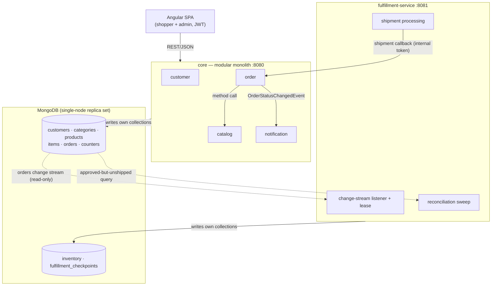

# Pet Store Modern

A migration of Sun's Java Pet Store 1.3.1 (J2EE 1.3, 2002) to a modern stack: Spring Boot 4.1 on Java 21, MongoDB, and Angular. The legacy application's four EARs, EJB entity beans, and XML-over-JMS order pipeline are re-implemented as two Spring Boot services over MongoDB documents — a modular `core` (catalog, customer, order, notification) and an extracted `fulfillment-service` driven by MongoDB change streams — with an Angular + PrimeNG storefront replacing the JSP front end.

## Architecture



Each collection has exactly one writer. Fulfillment reads the `orders` change stream but never writes core's data — shipment results return through core's internal REST callback. The change stream is the latency path; the reconciliation sweep (state-based, not event-based) is the delivery guarantee.

## Prerequisites

- Java 21
- Maven 3.9+
- Node 22
- Docker (with Compose)

## Build

```
mvn clean install
```

Docker must be running: the integration tests start throwaway MongoDB instances via Testcontainers.

To build without running the tests:

```
mvn clean install -DskipTests
```

## Run

1. Start MongoDB: `docker compose up -d` — a single-node replica set on `localhost:27017` (change streams need one).
2. Start core: `mvn -pl core spring-boot:run -Dspring-boot.run.arguments=--petstore.seed=true` — runs on `http://localhost:8080` and seeds the legacy Pet Store data (catalog, customers, admin user). Seeding is idempotent; omit the argument once seeded.
3. After core has logged `Catalog seeded`, start fulfillment in a second terminal: `mvn -pl fulfillment-service spring-boot:run -Dspring-boot.run.arguments=--petstore.seed=true` — runs on `http://localhost:8081` and seeds inventory.
4. Start the frontend in a third terminal: `cd frontend && npm ci && npm start` — then open `http://localhost:4200`.
5. Sign in as `j2ee` / `j2ee` (shopper) or `admin` / `admin123` (admin).

Both services can equally be launched from an IDE (`CoreApplication`, `FulfillmentServiceApplication`) with the `--petstore.seed=true` argument.
